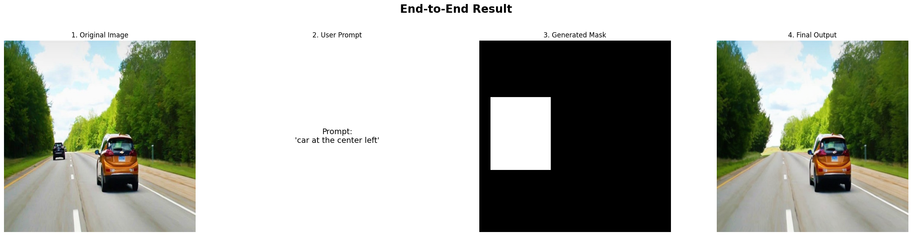
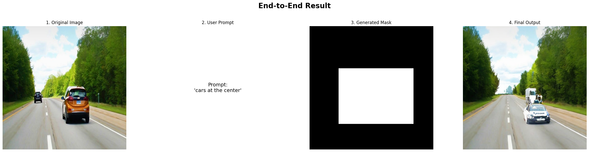

# Generative Image Inpainting for Text-Guided Object Removal


A deep learning project that demonstrates a two-stage pipeline for object removal in images. The system first uses a semantic segmentation model to identify and mask target objects, and then employs a generative inpainting model to realistically fill in the removed areas.

---

## Table of Contents
- [Project Description](#project-description)
- [Features](#features)
- [Project Structure](#project-structure)
- [Getting Started](#getting-started)
  - [Prerequisites](#prerequisites)
  - [Installation](#installation)
- [Usage](#usage)
- [Results](#results)
- [License](#license)
- [Acknowledgments](#acknowledgments)

---

## Project Description


This project implements a pipeline to intelligently remove objects from images given a prompt of the format: `[class][location]`, e.g. "person at the center". 
It leverages a U-Net-based model trained on the `[https://huggingface.co/datasets/paint-by-inpaint]` dataset to perform semantic segmentation, creating a mask of the object to be removed. Subsequently, a Diffusion model, finetuned with LoRA, uses this mask to generate realistic pixels, effectively erasing the object from the scene.

---

## Features

- **Semantic Segmentation:** Accurately identifies and masks objects into bounding boxes.
- **Generative Inpainting:** Fills the masked region with context-aware, realistic textures.
- **End-to-End Pipeline:** A series of notebooks guides the user from dataset preparation to the final demonstration.
- **Modular Design:** The segmentation and inpainting models can be trained or used independently.

---

## Project Structure

The repository is organized as follows:

```
├── notebooks/
│   ├── 01_Dataset_Preparation.ipynb      # Loads, preprocesses, and prepares the dataset.
│   ├── 02_Segmentation_Model.ipynb       # Builds, trains, and evaluates the U-Net model.
│   ├── 03_Inpainting_Model.ipynb         # Builds, trains, and evaluates the inpainting GAN.
│   └── 04_Final_Pipeline_Demo.ipynb      # Runs the full pipeline on sample images.
├── photos/                               # Contains 2 photos of the project implementation.
├── paper/                                # Contains the paper of the project.
├── requirements/                         # Packages needed for the execution.
└── README.md                             # This file.
```


---

## Getting Started

Follow these instructions to get a copy of the project up and running on your local machine.

### Prerequisites

- Python 3.8+
- Pip & Jupyter Notebook
- You will also need the specific libraries listed in `requirements.txt`.

### Installation

1.  **Clone the repository:**
    ```sh
    git clone [https://github.com/LefkiAth/deeplearning.git](https://github.com/LefkiAth/deeplearning.git)
    cd your-repository
    ```

2.  **Create and activate a virtual environment (Recommended):**
    ```sh
    # For Windows
    python -m venv venv
    .\venv\Scripts\activate

    # For macOS/Linux
    python3 -m venv venv
    source venv/bin/activate
    ```

3.  **Install the required packages:**
    *(First, you need to create the `requirements.txt` file. Run this command in your terminal to generate it automatically from your current environment):*
    ```sh
    pip freeze > requirements.txt
    ```
    *(Now, you can install the exact same packages using this command):*
    ```sh
    pip install -r requirements.txt
    ```

---

## Usage

The project is demonstrated through a series of Jupyter notebooks. They are designed to be run in sequential order to experience the full pipeline.

1.  **`01_Dataset_Preparation.ipynb`**: Start here to prepare your data for training. Run this code to download the dataset and make the required folders.
2.  **`02_Segmentation_Model.ipynb`**: Run this notebook to train the segmentation model.
3.  **`03_Inpainting_Model.ipynb`**: Run this notebook to train the inpainting model.
4.  **`04_Final_Pipeline_Demo.ipynb`**: Finally, run this notebook to see the complete object removal pipeline in action on new images.

---

## Results

Here are some examples of the model's performance on test images.




---

